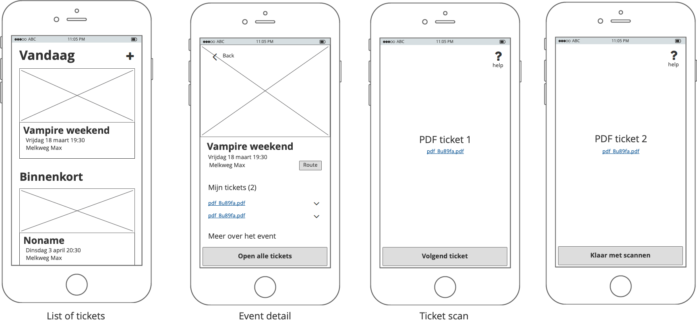
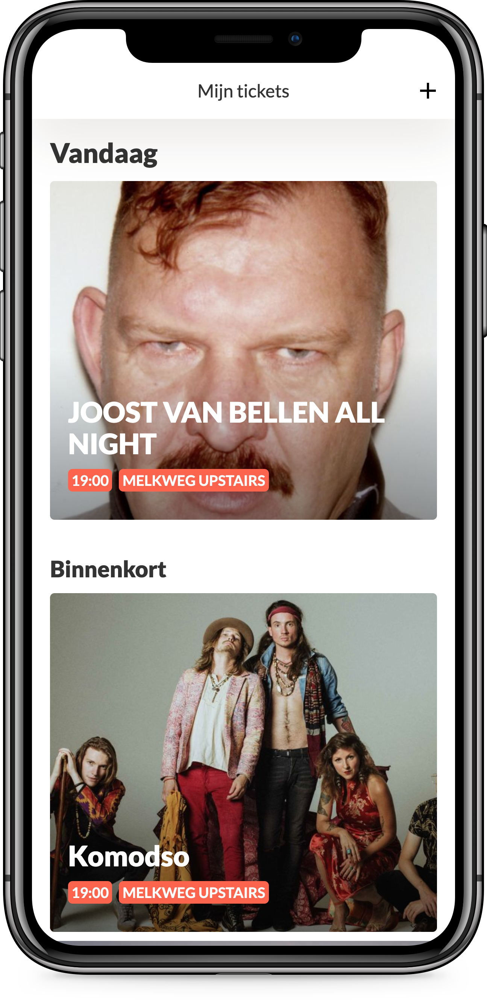
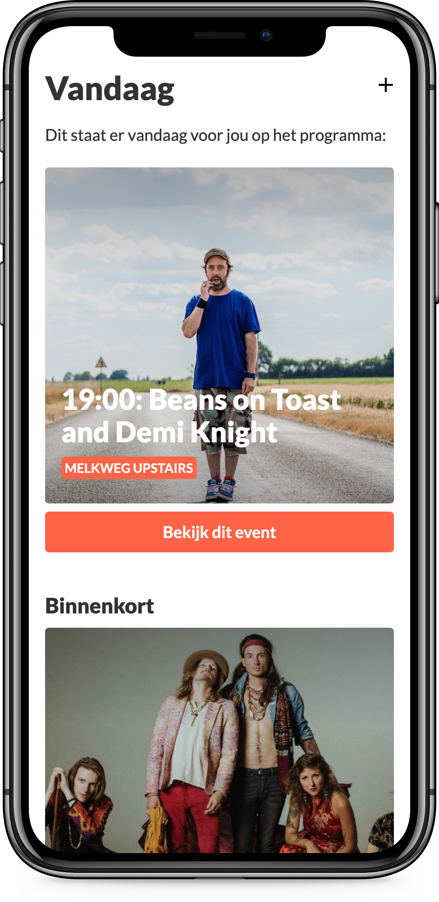

# How-to

Run this project:
```
npm install
gulp serve
```
Build this project:
```
npm install
gulp build

```
Deploy this project:
```
npm install
gulp build
npm deploy-iteration
```
### Dependencies:
This project uses the Giphy API.
Get [your own API key](https://developers.giphy.com/) and register as a `keys` object


# Web Design
In het vak Web Design leer je hoe je interface design principles goed kan toepassen, en hoe je met behulp van een user scenario kan ontwerpen en testen.

## Opdracht 1 - Verschillende versies van een Use Case testen en demonstreren
Voor deze opdracht gaan we leren [Interface Design Principles](http://bokardo.com/principles-of-user-interface-design/) toe te passen in een ontwerp.

### Opdrachtbeschrijving
Ontwerp een user interface voor een use case.  Werk je ontwerp uit in HTML, CSS en Javascript om te kunnen testen in een browser.

### Use Cases
//Een Use Case moet verschillende states in zich hebben.
- Ik wil door een overzicht van foto’s scrollen en info lezen, en een foto groot kunnen bekijken en als slideshow zien
- Ik wil een serie video’s kunnen filteren en sorteren om een leuk filmpje te vinden, en te kijken
- Ik wil artikelen in mijn winkelmandje kunnen bekijken, uit de lijst verwijderen, en de rest afrekenen
- In een overzichtspagina wil ik makkelijk kunnen switchen tussen … euh ...


### Beoordelingscriteria
- In de demo dien je rekening te houden met (minimaal 3?) interface design principles (sowieso #11) van de Principles of User Interface Design.
- Je ontwerp is aantoonbaar getest en verbeterd.
- Zorg dat minstens 2 mensen naar je demo kijken.
- Verslaglegging en resultaat publiceren op Github.


## Opdracht 1 -  [Uitwerking](https://cmd-opdracht-1.firebaseapp.com/)
De use case van deze opdracht kan beschreven worden als "Als gebruiker wil ik mijn gekochte tickets kunnen inchecken (pdf) als ik gestresst ben in de lijn van een concert".

De use case kan verder uitgelegd worden naar de volgende functionaliteiten:
- [ ] Weergeven van een lijst aan gekochte tickets
- [ ] Details bekijken van een gekocht ticket
- [ ] Ticket weergeven om te scannen

Daarnaast zal er gebruik gemaakt worden van de volgende (mirco)libraries
- [navigo](https://github.com/krasimir/navigo)  Een vanilla JS router met fallback voor oudere browsers
- [NoSleep.js](https://github.com/richtr/NoSleep.js?files=1) Vanilla JS library voor het actief houden van een beeldscherm (tijdens het scannen);
- [anime.js](http://animejs.com) Een vanilla minimal library die gebruikt wordt voor animaties 🤘.

### Schetsen

In de bovenstaande mockup zijn de 3 views van deze use case te zien. Van links naar rechts:
##### List of tickets
In dit overzicht kan de gebruiker zien welke tickets er toegevoegd zijn aan zijn/haar account.
De meeste focus ligt hier op het ticket dat vandaag gebruikt dient te worden, in het geval van de mockup het event "Vampire Weekend".
Bovenin de navigatie kan de gebruiker een nieuw ticket toevoegen.

##### Event Details
Hier vindt de gebruiker meer informatie uit het event. Zo is de route hier te vinden, een beschrijving van het event, en - niet geheel onbelangrijk - het scannen van de tickets. 

##### Ticket scan
De PDF's (indien de gebruiker meerdere tickets voor hetzelfde event bezit) worden een voor een uitgeserveerd. 
Via een iframe wordt de pdf ingeladen, waarna deze bij de ingang van de event locatie gescanned kan worden. Na het afronden van het laatste ticket wordt de gebruiker weer terug naar het event scherm gestuurd. 

### Principles of User Interface Design.
De kern van deze opdracht is het toepassen van de [Principles of User Interface Design](http://bokardo.com/principles-of-user-interface-design/) toepassen.
Hieronder staan enkele van deze principles uitgelicht, met een beschrijving hoe deze verwerkt is. 
#### 11 - Strong visual hierarchies work best
Visuele hierarchie wordt aangegeven via de tekstgrootte. Hierdoor is het voor de gebruiker goed te zien wat het belangrijkste op de pagina is. Om dit goed toe te passen is er voor een typografie gekozen met een sterk contrast. het belangrijkste - het ticket van vandaag - zal groot aangegeven worden, en alle minder belangrijke componenten ontvangen zo dan ook minder aandacht.

#### 14 - Progressive disclosure
Om er voor te zorgen dat de gebruiker in de eventueel stressvolle situatie als een rij voor een event zo gemakkelijk mogelijk door de flow te loodsen, is dit een belangrijk principe. Door elke view een specifiek doel te geven is het direct duidelijk voor de gebruiker wat te doen.
Scherm 1:  het selecteren van een event
Scherm 2: Het openen van de tickets
Scherm 3: ticket voor ticket door de flow heen lopen

#### 8 - Provide a natural next step
Dit principe sluit goed aan op het eerder besproken principe "Progressive Disclosure". Door niet alleen elke pagina een duidelijk doel te geven, maar ook de volgende stap als grote knop fixed onderin te zetten, stapt de gebruiker op een natuurlijke wijze door het scannen van de tickets heen. Daarbij scheelt het dat deze use case een duidelijk doel heeft: zo snel en gemakkelijk mogelijk door het ticket scannen heen lopen.

#### 7 Highlight, don't determine, with color
Hoewel de use case in de vorm van een prototype is uitgezet, en dus meer focus op functie heeft dan design, wordt kleur wel toegepast. Wanneer er weinig kleur in een design gebruikt wordt is het een sterke manier om nog meer focus op de happy-flow te geven. Zo heeft de navigatie knop "open tickets" een accent kleur gekregen.

### Uitwerking

### Testen

Uit de test zijn de volgende punten gekomen:
- De gebruiker kan direct de tickets van de komende tijd zien, maar deze zijn eigenlijk helemaal niet belangrijk. Liever meer focus op het ticket van vandaag.
- De gebruiker kan niet zien hoe laat het event precies begint, en zou dit graag terug zien
- Textueel: het is niet duidelijk dat "open alle tickets" gelijk staat aan het scannen van de tickets
- Na het scannen van de tickets zou de gebruiker graag een "veel plezier!" scherm willen zien, omdat nu letterlijk het feestje gaat beginnen.

### Iteratie
Aan de hand van de testresultaten zijn de volgende onderdelen toegevoegd:
- Er is meer focus op het event van vandaag gecreeerd
- Het tijdstip is nu duidelijker zichtbaar
- Na het scannen van een ticket is er een bedankt scherm geintroduceerd


De iteratie is [hier]() te bekijken
