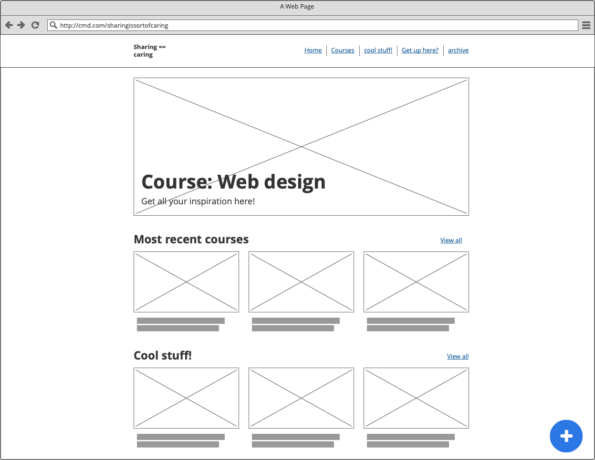
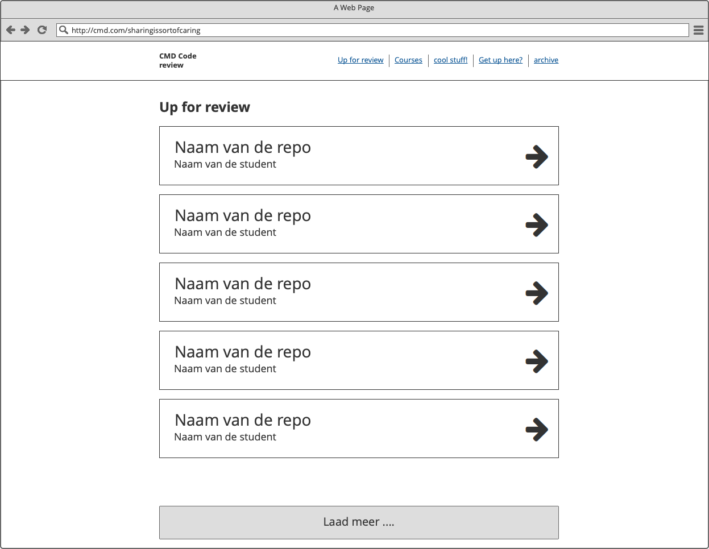
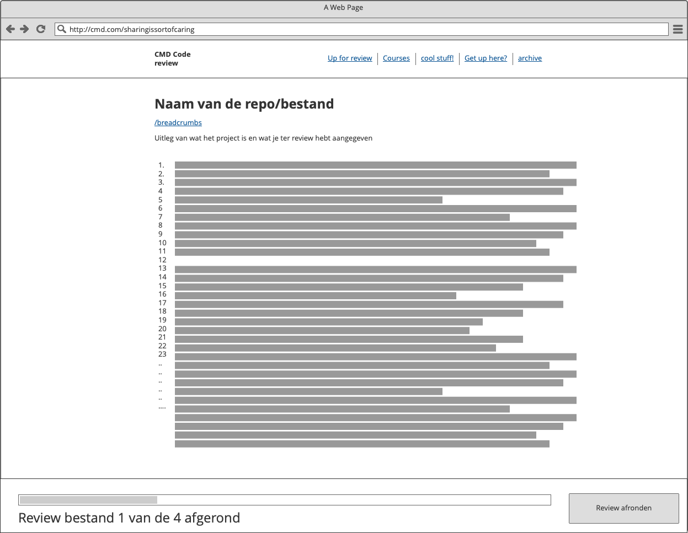

# Readme web design opdracht 2
# About this repo

Run this project:
```
npm install
gulp serve
```
Build this project:
```
npm install
gulp build

```
Deploy this project:
```
npm install
gulp build
npm run deploy-iteration
```

### Dependencies:
This project uses  the Github api to fetch any resources from git, as wel as firebase to store some of these. 
Make sure to include your own `GITHUB_CLIENT_ID` & `GITHUB_CLIENT_SECRET` in the project as a `keys` object. Register for the keys [here](https://auth0.com/docs/connections/social/github).
Get [your own API key](https://developers.giphy.com/) and register as a `keys` object


# CMD Web Design

Web Design gaat over het ontwerpen en testen van Interactie. Het voordeel van een Frontend Developer (of Web Designer) is dat die techniek begrijpt, kan toepassen én verstand heeft van UX en design. Als je Web technieken begrijpt kun je je ideeën snel prototypen en testen met echte gebruikers, in een browser. Je kan dan aanpassingen doorvoeren, uitproberen en weer testen ...

In het vak Web design gaan we dingen ontwerpen voor echte mensen. Is er goede interactie? Kan je 'mens' je product op een prettige manier bedienen? Wat voor principes heb je gebruikt en getest? En zit er wel nonsense in?

### Leerdoelen
Leren hoe je (interface) (design) (in/exclusive) principles in een ontwerp kan toepassen.
User needs begrijpen en gebruiken in je ontwerp.
Leren hoe je moet testen en de resultaten gebruiken voor het verbeteren van je ontwerp.

## Uitwerking
Voor de opdracht heb ik gekozen om een share platform te bouwen voor de minor studenten. Via dit share platform kunnen studenten gemaakt werk met elkaar delen, onder het mom "Sharing is Caring". Daarnaast worden studenten vooral gestimuleerd om inspiratie met elkaar te delen in de vorm van artikelen, video's, demo's, whatever. 

Het share platform bevat de volgende functionaliteiten / user scenario's
- Als een gebruiker wil ik meer informatie zien over een specifiek vak
- Als een gebruiker wil ik het werk van andere studenten per vak kunnen zien in een duidelijk overzicht met daarin de beschrijving van het gemaakte werk, en een link naar de demo omgeving
- Als een gebruiker wil ik een overzicht kunnen zien van inspirerende artikelen, afbeeldingen, video's en andere internet-bronnen
- Als een gebruiker wil ik inspirerende artikelen, afbeeldingen, video's en andere internet-bronnen kunnen delen met andere gebruikers.

### Mockups Iteration 1



### Techniek
Voor de uitwerking heb ik als basis de frontend van opdracht 1 toegepast. Hierdoor was de SPA al snel up-and-running, en dient als goede basis voor opdracht 2. Door middel van sass is de css gestructureerd, waar de basis van de BEM principes zijn toegepast (maar vrij middelmatig, het blijft een rapid-prototype). 

Van de volgende externe bronnen is er gebruik gemaakt:
- [forEach Polyfill(?)](https://gomakethings.com/looping-through-objects-with-es6/) for forEach-ing an object (Firebase sometimes returns objects instead of array for some reason...)
- [ejs](https://ejs.co/) - render EJS templates client-side
- [EventEmitter](https://github.com/Olical/EventEmitter) - Voor de super-fancy SPA events na het inladen van partials
- De GitHub API om de bronbestanden op te halen van de repo’s

## Eerste feedback ronde
Tijdens de eerste feedback ronde kwam ik er al snel naar voren dat ik de opdracht niet helemaal heb begrepen, en veel te enthousiast aan een platform ben gaan werken. [exclusive Design](https://exclusive-design.vasilis.nl/) heb ik voor geen meter toegepast, in tegenstelling, ik was telkens aan het proberen om iets te ontwerpen dat zowel door Marijn als voor studenten te gebruiken was.

Tijdens de demo's van mede-studenten kwamen veel goede punten naar voren die meegenomen gaan worden naar de tweede iteratie.

## Tweede iteratie
Bij de tweede iteratie heb ik een aantal doelstellingen opgesteld, waar de nieuwe versie aan moet voldoen.

- Marijn gebruikt meer het trackpad dan verwacht, en maakt daarnaast nooit gebruik van de tab. In het nieuwe ontwerp zal de interactie op beide manieren ondersteund moeten worden (toetsenbord + trackpad)
- Marijn gebruikt safari, hier zal de site op geoptimaliseerd worden
- Wanneer het toetsenbord gebruikt wordt moeten de gebruikte toetsen dichter bij elkaar liggen.
- Native form controls zijn een uitdaging, want ze zijn op elke browser. Ik wil ergens in het design gebruik maken van native form controls, om te kijken wat hier te optimaliseren valt. 
- De huidige state van de web applicatie moet altijd duidelijk zijn. 
- Het nieuwe ontwerp moet (bijna) alleen door Marijn te gebruiken zijn. De studenten zijn in deze demo niet relevant. 

Terug naar de tekentafel dus, met ook een nieuw concept rondom het platform. De focus ligt nu veel meer op de code reviews de Marijn kan uitvoeren.
Kort samengevat bevat het platform uit de volgende functionaliteiten:
- Via grote knoppen een te reviewen project selecteren uit een overzicht.
- De bestanden die te reviewen zijn worden een voor een uitgeserveerd. Zo hoef je niet in een file structure te gaan navigeren, want dit maakt het onnodig complex.
- Via het toetsenbord, maar ook met het trackpad, stapsgewijs door de code heen lopen.
- Door middel van emoji's (want wat spreekt er meer dan emoji's) aangeven of de lijnen code heel vet zijn, of juist nog even opnieuw bekeken moeten worden.
- Meerdere lijnen ter review kunnen selecteren
- Na afloop van de review nog een bericht meesturen door middel van native form controls

### Mockups Iteration 2

Het overzicht

De review pagina


### Technische uitwerking
Aan de nieuwe iteratie zijn een aantal nieuwe technieken toegevoegd. Zo maak ik nu gebruik van Spatial Navigation, een library ter voorbereiding van de nieuwe spec, die nog niet geïmplementeerd is.

- [Spatial Navigation](https://davidwalsh.name/spatial-navigation) - Navigeer via de pijltjes toetsen volgens de nieuwe [spec](https://www.w3.org/TR/2019/WD-css-nav-1-20190423/)

### Demo
Tijdens de demo zijn er nog een paar belangrijke punten naar voren gekomen die verbeterd moeten worden.

#### Demo - Algemeen
- Zorg dat de belangrijke elementen altijd binnen de viewport zijn. Marijn scrolt niet makkelijk, en zou dan ook niet zo snel door de pagina heen scrollen om te kijken wat er nog meer is
- Slimme oplossing: Na het invullen van een dropdown heeft een student ingebouwd dat de focus direct doorgaat 
- Slimme oplossing: Een andere student heeft zelfs een joystick meegenomen als muis, om daarmee zijn demo te bedienen. 

#### Demo - Eigen demo
- De native form controls werken inderdaad niet heel goed. Eventueel iets met een timeout toevoegen, zodat ze minder gevoelig worden. De focus van een input element is namelijk heel snel weg.
- De  gebruikte toetsen zitten te ver uit een. Daarnaast heeft Marijn veel met VI gewerkt, en is het goed om de (shortcuts)[https://vim.rtorr.com/] hiervan toe te passen.
- De quote van Marijn:

> 	Ik Ben niet zo gehandicapt!  

- Oftewel, ik had een functionaliteit toegevoegd waarbij hij meerdere toetsen voor dezelfde actie kan gebruiken, maar dat was dus een overkill
- Over het algemeen was Marijn erg enthousiast, de manier van code reviews werkte goed, doordat hij door de code een kon gaan met de pijltjes toetsen.
- Ook de tweede versie van de demo, waar hij een “predefined” bericht kon sturen, kwam goed binnen. De native form controls waren iets te gevoelig, en hier kan nog wat aan getweaked worden, maar het lukte hem al snel een bericht te versturen.

## De terugblik
Wat voor mij vooral een interessant inzicht was, is het feit dat het internet inderdaad voor iedereen is, en er ook personen je producten kunnen gebruiken zonder dat je dat verwacht, in dit geval Marijn.
Ik merkte dat ik in dat punt bij de eerste iteratie nog wat moeite had. Te gewend zijn om iets te ontwerpen dat voor een ‘gemiddeld’ mens te gebruiken was, in plaats van exclusive design, alleen voor Marijn. Dit betekende voor mij dat ik weer flink terug naar de tekentafel moest, om juist meer over het design dan over het concept na te denken. Mocht ik het vak nog een keer volgen dan zou ik mij van te voren nog meer verdiepen in Marijn. Wat voor programma’s gebruikt hij nu bijvoorbeeld, daar kun je veel van spieken. Nu bedenkt elke student natuurlijk zijn eigen manier van interactie, met zijn eigen shortcuts en methoden, maar het zou netter zijn om hier een standaard voor te maken.

Voor het vak dacht ik altijd over accessibility - gewoon. Een nette semantische website maken, maar er komt inderdaad veel meer bij kijken, wat je in je design proces mee kunt nemen. 