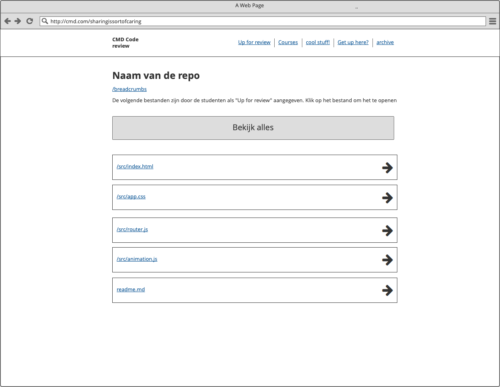

# How-to

Run this project:
```
npm install
gulp serve
```
Build this project:
```
npm install
gulp build

```
Deploy this project:
```
npm install
gulp build
npm run deploy-iteration
```
### Dependencies:
This project uses  the github api to fetch any resources from git, as wel as firebase to store some of these. 
Make sure to include your own `GITHUB_CLIENT_ID` & `GITHUB_CLIENT_SECRET` in the project as a `keys` object. Register for the keys [here](https://auth0.com/docs/connections/social/github).
Get [your own API key](https://developers.giphy.com/) and register as a `keys` object

#### External libraries
- https://davidwalsh.name/spatial-navigation
- https://github.com/Olical/EventEmitter
- Polyfill (?) for forEach-ing an object
- https://ejs.co/


Of course, this documentation will be further updated!


### Mockups Iteration 1

### Mockups Iteration 2



